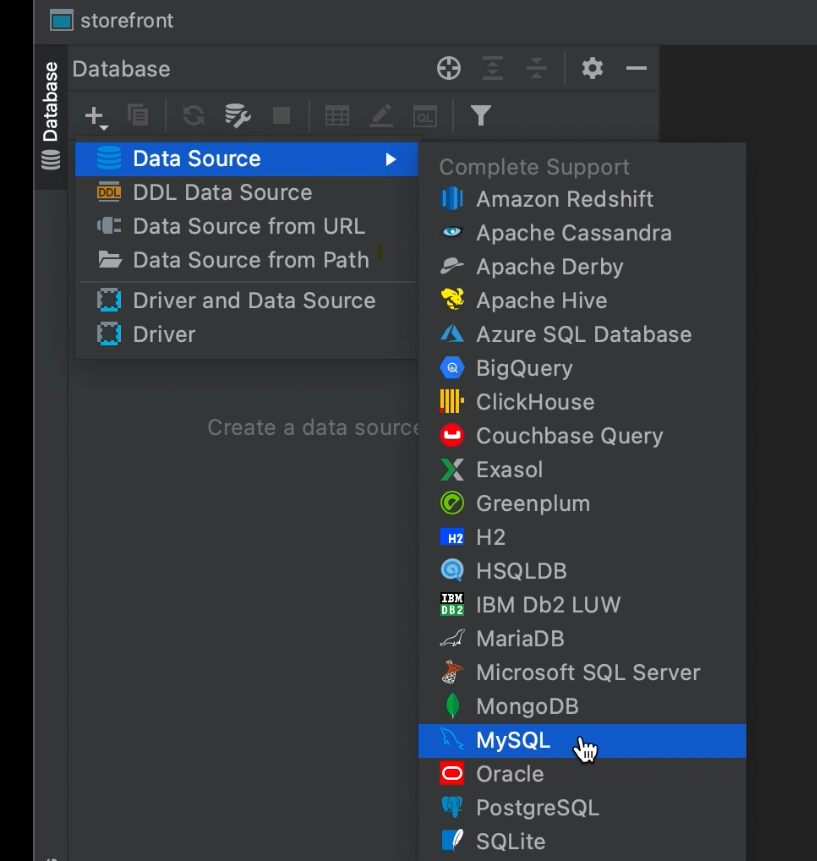
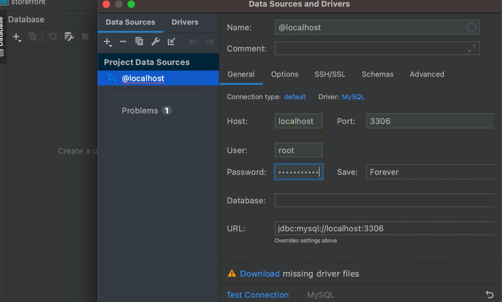

## Connecting to MySQL

- To connect django to MySQL we need some tools called MySQL Clients

___Example___

1. _MySQL WorkBench (free)_
2. _TablePlus_
3. _DataGrip (has 30 days free trial, recommended)_ 

- If you are using `DataGrip` to connect first create project for this time called `onlinestore`

- The connect to mysql server as follows

- Then fill info as you install mysql
- use password you used in installing MySQL
- If you change the username also use that username
- write your database you used in this project
- If you get missing driver error then download automatically (nice feature of DataGrip)
- Test connection
- if you get error like server returns invalid timezone
- The click `settimzone` and set the timezone to `UTC`
- Then test again

- Then you can open console by right click on the server name them click open new console
- Then you can do any thing like
    - _create database_
    - _create table_
    - _insert data_
    - _query data_