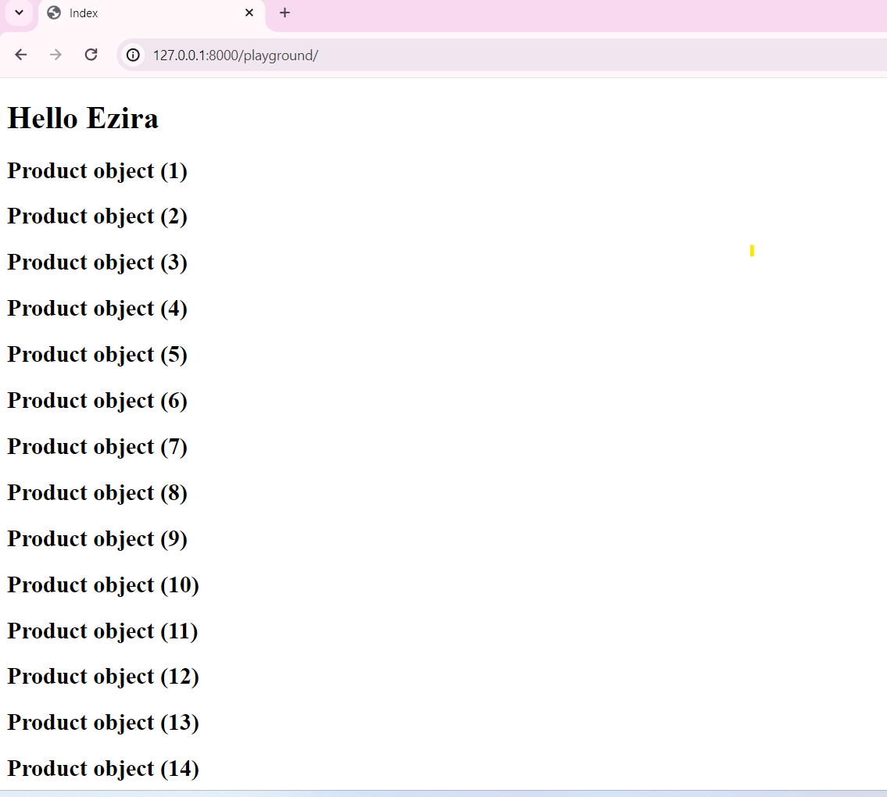

## Managers and Querysets

- Every model has manger it return an API for interaction between the model class and the database
- Through this API you can 
    -  _Get data_
    - _Filter data_
    - _Group data_
    - _Sort data_

- For example `product` model has `Product` manager
- This return Product.objects API to fo the above things

___QuerySet___

- Query Set is an object returned by the API when we make the above operation
- Let us update say_hello function of views module in playground app
- Change its name to index and try to get all products from the database through product manager

```python
from django.shortcuts import render
from django.http import HttpResponse
from store.models import Product

def index(request):
    querySet = Product.objects.all()
    return render(request, 'index.html', {'name': 'Ezira'})
```
- Variable querySet store a set of query retrieved from the database table 

- Let us send the query set to the template file as context
- To send let us cast to list for simplicity
- To cast to list simply wrap with keyword `list`
- Then add to the context mapping object as `products`

__let us modify the above method__

```python
from django.shortcuts import render
from django.http import HttpResponse
from store.models import Product

def index(request):
    # accessing the product objects through queryset
    querySet = Product.objects.all()
    # Casting querySet to list
    querySetList = list(querySet)
    return render(request, 'index.html', {'name': 'Ezira',
    'products':querySetList })
```

- Then let us modify the template file `index.html`
to display list of product objects

```html
<!DOCTYPE html>
<html lang="en">
<head>
    <meta charset="UTF-8">
    <meta name="viewport" content="width=device-width, initial-scale=1.0">
    <title>Index</title>
</head>
<body>
    <h1>Hello {{name}}</h1>
    
    <h2>{{product}}</h2>
    
</body>
</html>
```

### Explaining the above code

- This is simple html file rathe than there are some additional things which is embedding python code in html file
- if you want to embed expression use the following command

```html
{{ expression }}

```

_Example_

```html
{{name}}
```
- if you want to embed conditional statement like for loop or if use the following and close it
- To close for loop use endfor
- To close if use endif

```html

<!-- html code here -->


```

_Example_

```html


<h2> {{product}} </h2>


```

- if you run your server and navigate to url (127.0.0.1:8000/playground) you will get as follows



- As we see in the picture it is simply list of product object so we have to use its attribute rather display product object for readability

- Modify the content of the for loop in the template as follows

```html
<h2> {{product.title}} </h2>
```

- Then you will get as follows

