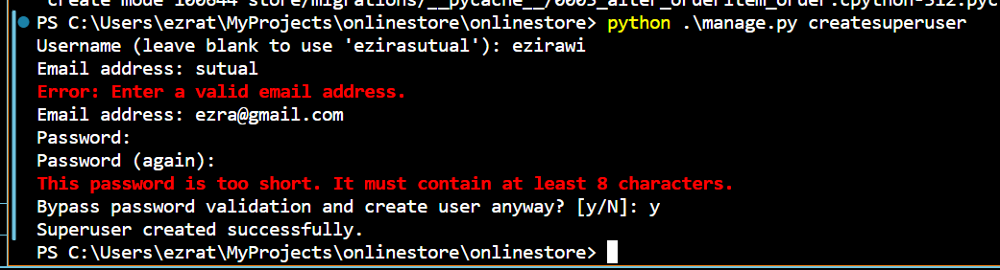

## Setting up Admin Site

- We can access admin site at url `/admin`
- But before that we have to create admin manually
- To create admin manually we can use the following command

```bash
python manage.py createsuperuser 
```
- Then it will ask username, email and password 
- Fill those cerrectly adn don't forget


