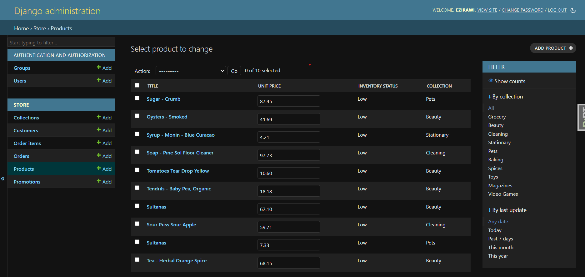

## Adding Filtering

- We can add fields wich we want to filter our list 

- Let us add filtering by collection and last_update on product list page

```python

@admin.register(Product)
class ProductAdmin(admin.ModelAdmin):
    list_display = ['title', 'unit_price', 'inventory_status', 'collection']
    list_editable = ['unit_price']
    list_per_page = 10
    list_filter = ['collection', 'last_update']
    ordering = ['inventory']
    def inventory_status(self, product):
        if product.inventory < 10:
            return 'Low'
        return 'Ok'
```
- This will make builtin filtering lists tob displayed on the right side as follows



- We can add custom filtering by creating custom filter class which inherits `admin.SimpleFilterClass`

```python

# Creating Custom Inventory filter


class InventoryFilter(admin.SimpleListFilter):
    title = 'inventory'
    parameter_name = 'inventory'

    def lookups(self, request: Any, model_admin: Any):
        return [
            ('<10', 'Low'),
            ('else', 'Ok'),
        ]

    def queryset(self, request, queryset):
        if self.value() == '<10':
            return queryset.filter(inventory__lt=10)
        elif self.value() == 'else':
            return queryset.filter(Q(inventory__gte=10))

        return queryset
```

___Explanation___

- This class should inherit `admin.SimpleListFilter` class
- Then we have to set two necessary attributes
    - _title_ -> Which is to be displayed in the filter page
    - _Parameter name_ -> an attribute used in filtration url after symbol `?`

- Then we have to implement Two necessary methods by overriding them in the parent class
    1. _lookups_ used to contain the filtration list to be displayed and its condition parameter
    2. _queryset_ this is used to filter the query set based on the lookup parameter
    
- Then add this in to filter_fields list of ProductAdmin as follows

```python

@admin.register(Product)
class ProductAdmin(admin.ModelAdmin):
    list_display = ['title', 'unit_price', 'inventory_status', 'collection']
    list_editable = ['unit_price']
    list_per_page = 10
    list_filter = ['collection', 'last_update', InventoryFilter]
    ordering = ['inventory']
    def inventory_status(self, product):
        if product.inventory < 10:
            return 'Low'
        return 'Ok'
```


