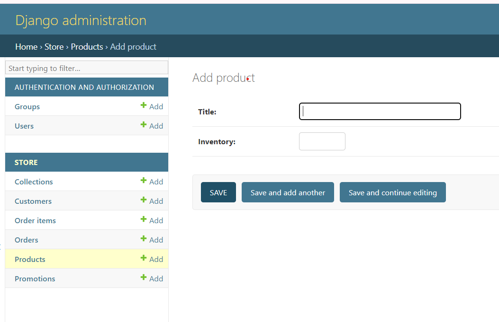
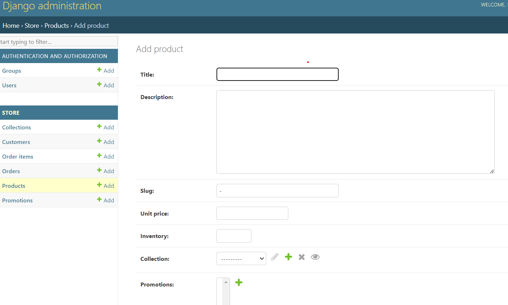

## Customizing Forms

- One of best feature of django is giving builin forms to add new objects of models
- As follows 


- We can customize this form by execluding some fields as follows

```python

@admin.register(Product)
class ProductAdmin(admin.ModelAdmin):
    fields = ['title', 'inventory']
```
- This will display only title and inventory fields


- We can also execlude some fields as follows

```python

@admin.register(Product)
class ProductAdmin(admin.ModelAdmin):
    execludes = ['title', 'inventory']
```


- We can also make a field readonly

```python

@admin.register(Product)
class ProductAdmin(admin.ModelAdmin):
    readonly_fields = ['title', 'inventory']
```