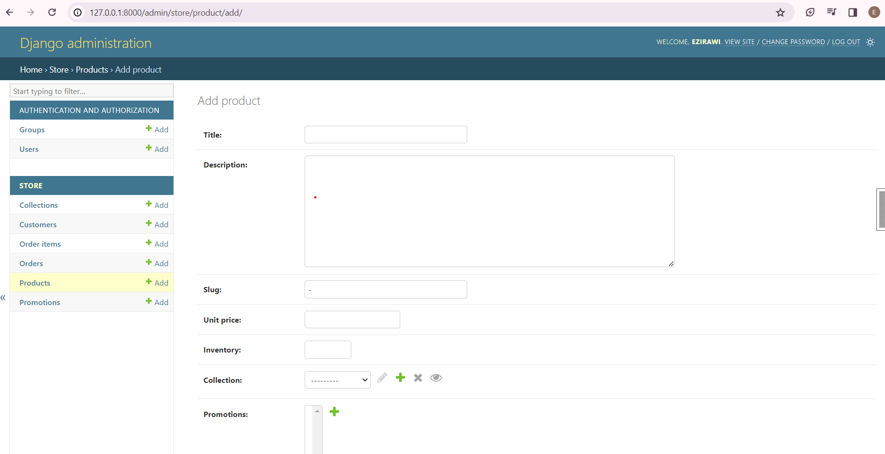

## Customizing Forms

- One of best feature of django is giving builtin forms to add new objects of models
- As follows 


- We can customize this form by excluding some fields as follows

```python

@admin.register(Product)
class ProductAdmin(admin.ModelAdmin):
    fields = ['title', 'inventory']
```
- This will display only title and inventory fields


- We can also exclude some fields as follows

```python

@admin.register(Product)
class ProductAdmin(admin.ModelAdmin):
    excludes = ['title', 'inventory']
```


- We can also make a field readonly

```python

@admin.register(Product)
class ProductAdmin(admin.ModelAdmin):
    readonly_fields = ['title', 'inventory']
```

- Converting dropdown list to autocomplete

- Drop down list of so many objects is bad for optimization so we should convert it to auto completed

___Example___
- We can convert as drop down list (collection) in product as follows

___Precondition___

    1. str representation of collection class overrided to return its title in Collection class
    2. title attribute should be added to the search field list of CollectionAdmin class
    3. Then add collection to autocomplete_fields list inside ProductAdmin class

- ___Let us do it___

- Overriding str representation method
```python
class Collection(models.Model):
    # other code here
    def __str__(self):
        return self.title
```
- Adding title to search fields

```python
class CollectionAdmin(admin.ModelAdmin):
    # other code here
    search_fields = ['title']
```

- Then adding collection to autocomplete_fields list

```python

class ProductAdmin(admin.ModelAdmin):
    autocomplete_fields = ['collection']
```
