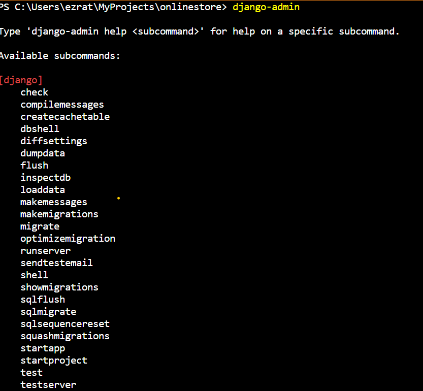
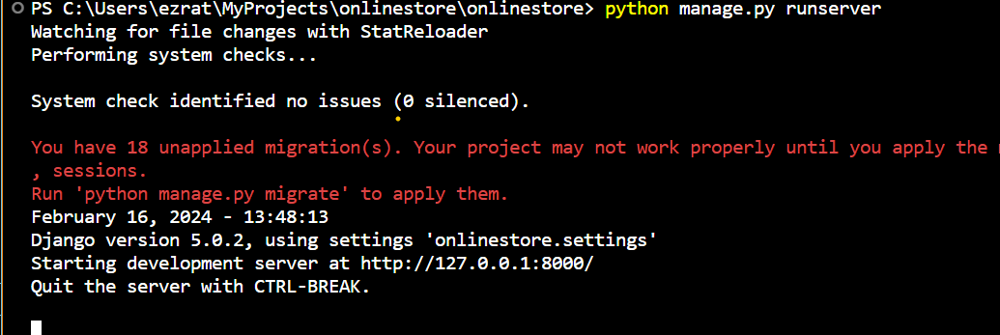
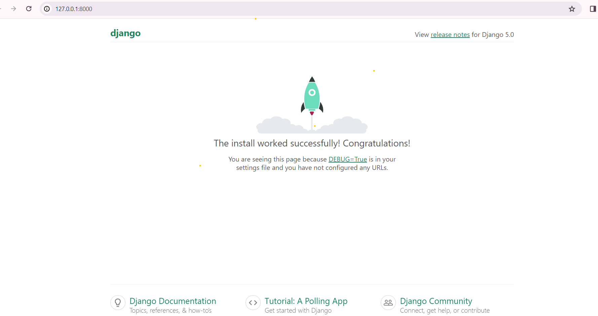

## First Gjango Project

1. Goto the place you want to create your project

```bash
cd Desktop
```
2. Then create directory for your django project and navigate to the directory

```bash
mkdir OnlineStore
cd OnlineStore
```
3. Install djnago through `pipenv` and check your djnago version
```bash
pipenv install django
django --version
```
4. Open your project in code editor
if you have vs code you can use the following command to open it in vs code
```bash
code .
```
5. After you istall django you can do different things with command `django-admin <options> `
you can get the options by typing command `djnago-admin` alone
```bash
django-admin
```


6. To create your django project  use command `django-admin startproject` followed by project name
```bash
django-admin startproject onlinestore
```


7. Run web server

> You can also use `puthon manage.py` instead of `django-admin`

> To run the web server with `python manage.py` 
```bash
python manage.py runserver
```

- if you get this error like stucture like this do not worry about it is not error.
- It is unpplied migrations (we will back to it leter)



8. You can  open link http://127.0.0.1:8000 by pressing (CTRL + Click)

9. You will get
