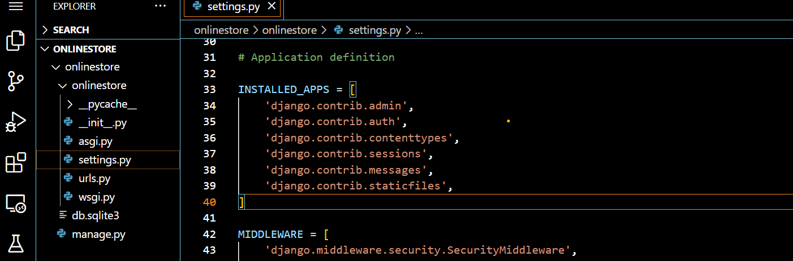
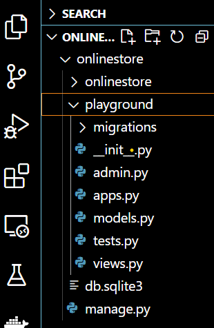
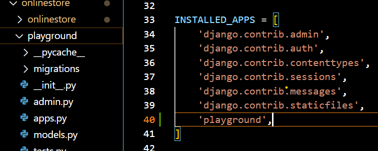

## Create Apps inside our Project

- Django project is a collection of apps
- This is nice part of django to create different app for different functionality of the project 
- Django Project is like our mobile phone it has different apps inside it but the combination of those apps give function of our mobile phone
- Every django project vy default contains apps that are found  in list of `INSTALLED_APPS` inside `setting.py` file 
- `setting.py` constains different configuration of the project

### Default Installed Apps


### Some Discription for those installed apps
1. `admin` APP to build the admin site
2. `auth` APP  to authentication
3. `contentTypes` to make generic relationship 
4. `sessions` to manage user data onthe server
5. `messages` to send on time notification to user
6. `staticfiles` to manage static files like image CSS

### To create your own app inside your project

- Make sure you are inside your project and type command `python manage.py startapp` followed by your app name
- For this project let us create `playground` app
```bash
python manage.py startapp playground
```

- Then you will get the following file structure in your project



### Let me explain modules and folders inside Playground app

1. `migrations` folder
    - This filder contians different migration files that will generate database tables when we migrate it(We will see it later in database section)
2. `admin` module
    - To define how the admin inteface going to look like
3. `apps` module
    - It is where we configure this app
4. `models` module 
    - It is where we define different models inside the database
5. `tests` module
    - It is where we write a unit test 
6. `views` module
    - It is where we write views to display responses to client

### Register App to the Installed Apps
- Finally we have to register this app into `INSTALLED_APPS` inside  `setting.py` file

