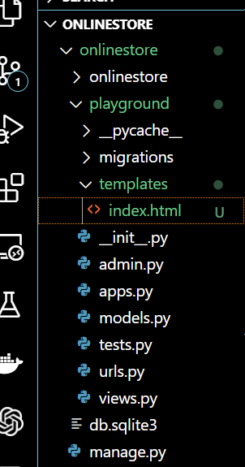
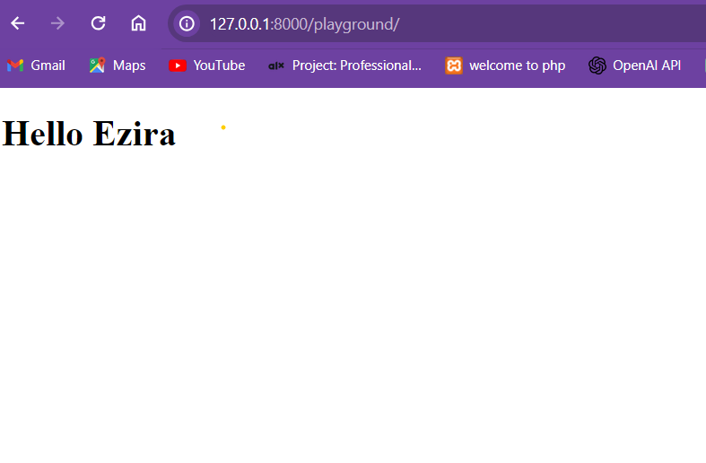

## Templates

- When we handle a request we can return `html` file rather than simple string or number
- So to handle a request we can use template to write the html files and return them to the client based on the request

___Let use create `templates` folder and add `index.html` file inside it in `playground` app___



- write some heading in `index.html` file

```html
<!DOCTYPE html>
<html lang="en">
<head>
    <meta charset="UTF-8">
    <meta name="viewport" content="width=device-width, initial-scale=1.0">
    <title>Index</title>
</head>
<body>
    <h1>Hello Everyone</h1>
</body>
</html>
```

- Then update or say_hello fucntion in our views in playground app to return this html file by using `render` function

```python

def say_hello(request):
    return render(request, 'index.html')
```

### Let me explain parameters of `render` function

1. `request` parameter represent the reqeust to be handled
2. `template file ` to indicate the html file to be returned 
3. `context` this is a dictionary `({})` like structure called `Mapping`  which contains information to be sent to front end
- Then when we browse with url `http://127.0.0.1:8000/playground/`

- We will get the following


- But this html files is static so we can pass some information to this template file and display to the client

- Update `say_hello` function Adding contextas  third parameter
```python

def say_hello(request):
    context = {
        name: 'Ezira'
    }
    return render(request, 'index.html', context)
```
- Update `index.html` file to display the context


```html
<!DOCTYPE html>
<html lang="en">
<head>
    <meta charset="UTF-8">
    <meta name="viewport" content="width=device-width, initial-scale=1.0">
    <title>Index</title>
</head>
<body>
    <h1>Hello {{name}}</h1>
</body>
</html>
```

- Then we will see the following

