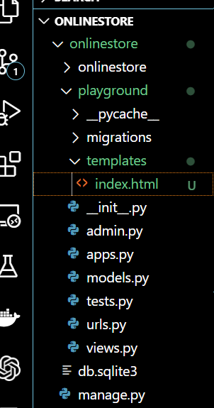

## Templates

- When we handle a request we can return `html` file rather than simple string or number
- So to handle a request we can use template to write the html files and return them to the client based on the request

### Let use create `templates` folder and add `index.html` file inside it in `playground` app
